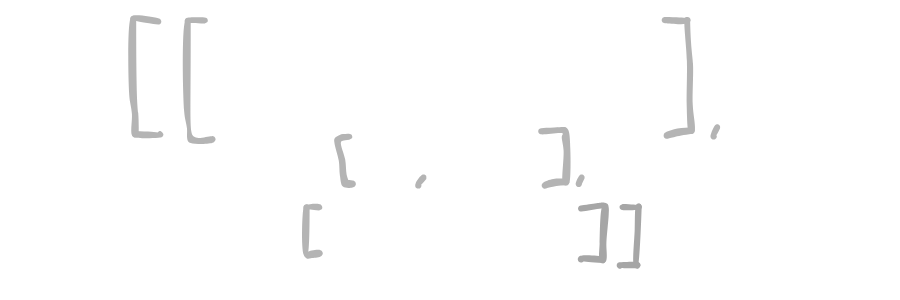

<div align="center">
<picture>
  <source media="(prefers-color-scheme: light)" srcset="/docs/tensors-cpp-light.png">
  
</picture>
</div>

Just a toy recreation of PyTorch (CPU only *for now*) Tensor Library that I used for learning purposes and experimentation.

## Features

- **Basic Tensor Operations**: Core operations including matrix multiplication, element-wise operations, and more
- **Neural Net Modules**: Building blocks for neural networks, including linear layers, activation functions (*in progress*) and more.
- **Basic Automatic Differentiation**: Full backward pass support for gradient computation
- **Educational Focus**: Stripped back and extremely simplistic code that breaks down the fundamental concepts.
- **No external deps**

## Getting Started

### Building the Project

```bash
# Clone the repository
git clone https://github.com/hysmio/tensors-cpp
cd tensors-cpp

# Build the project
make debug

# Run the executable
./build/bin/llm-cpp
```
